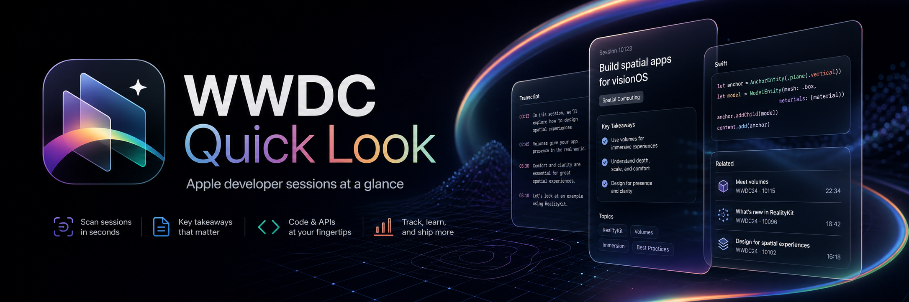

# WWDC Quick Look Skill

[English README](README.md)
[](https://www.skills.sh/swiftggteam/wwdc-quick-look)
[落地页](https://wwdc-quick-look.swiftgg.team)

WWDC Quick Look 是一个面向 Agent 的本地 skill，用来快速查询 Apple WWDC session 的元数据、视频逐字稿、Code tab 代码片段和 Resources 链接。

推荐通过 skills.sh 一条命令分发和安装，然后让 Agent 在遇到 WWDC 问题时直接调用 `wwdc-quick-look`。这个仓库也包含支撑该 skill 的爬取脚本和发布数据。默认工作流是 local-first、no-key：从公开 Apple Developer 页面读取内容，写成结构化 JSON 和 transcript 文本，并通过 jsDelivr 提供最新归档。

## 通过 skills.sh 安装

```sh
npx skills add SwiftGGTeam/wwdc-quick-look
```

skills CLI 会自动发现本仓库中的 `skills/wwdc-quick-look/SKILL.md`，并把它安装到本机 Agent 的 skill 目录中。这是推荐的分发方式，适用于 skills.sh 支持的 Codex、Claude Code、Cursor 等 Agent 运行时。

## 这个 Skill 能做什么

当用户询问 WWDC session、Apple 平台新特性、示例代码、demo 工程、Code tab、Resources 链接或逐字稿时，使用 `wwdc-quick-look`。

它可以：

- 列出可用 WWDC 年份和主题
- 搜索 session 标题、描述、Resources 和 Code snippets
- 展示单个 session 摘要，包括资源数量和代码片段数量
- 展示 Resources 链接，例如文档、sample-code 页面、GitHub 仓库和 demo 工程
- 展示带时间戳和跳转链接的 Code tab 代码片段
- 读取本地或 CDN 数据中的 transcript 文本

## 仓库结构

```text
skills/
└── wwdc-quick-look/          # skill 真源
    ├── SKILL.md
    ├── scripts/query.mjs
    └── references/data-schema.md

playground/
├── .agents/skills -> ../../skills
└── .claude/skills -> ../../skills

data/
├── index.json
├── wwdc20/
├── wwdc21/
├── wwdc22/
├── wwdc23/
├── wwdc24/
└── wwdc25/
```

`skills/` 是唯一真源。`playground` 下的两个软链接让需要 `.agents/skills` 或 `.claude/skills` 的 Agent 运行时都能加载同一份 skill。仓库根目录不再保留 `.agents/skills` 副本。

## 直接运行查询脚本

安装 skill 后，Agent 会按需调用这个脚本。调试或本地验证时，也可以在仓库根目录直接运行：

```sh
node skills/wwdc-quick-look/scripts/query.mjs list-years
node skills/wwdc-quick-look/scripts/query.mjs search --year 2025 --keyword "visionOS"
node skills/wwdc-quick-look/scripts/query.mjs show-session --year 2025 --code 290
node skills/wwdc-quick-look/scripts/query.mjs resources --year 2025 --code 290
node skills/wwdc-quick-look/scripts/query.mjs code --year 2025 --code 290 --limit 3
node skills/wwdc-quick-look/scripts/query.mjs transcript --year 2025 --code 290 --limit 20
```

查询脚本默认读取公开 CDN 数据：

```text
https://cdn.jsdelivr.net/gh/SwiftGGTeam/wwdc-quick-look@main/data/
```

本地测试时可以覆盖数据源：

```sh
WWDC_QUICK_LOOK_BASE_URL=http://127.0.0.1:8765 \
  node skills/wwdc-quick-look/scripts/query.mjs list-years
```

## 数据覆盖

本地已提交的数据覆盖 WWDC 2020 到 WWDC 2025。

| 年份 | Sessions | Transcript 文件 | 含 Resources 的 sessions | 含 Code snippets 的 sessions |
|------|----------|-----------------|---------------------------|------------------------------|
| 2020 | 209 | 206 | 150 | 124 |
| 2021 | 207 | 204 | 176 | 127 |
| 2022 | 316 | 184 | 142 | 118 |
| 2023 | 316 | 181 | 122 | 100 |
| 2024 | 123 | 123 | 117 | 78 |
| 2025 | 122 | 120 | 113 | 80 |

部分 Apple Developer 条目是 Q&A、Meet the Presenter、Study Hall、keynote、ASL 或社区活动页面。Apple 页面没有公开 timestamp transcript 时，manifest 会把该条目标记为 `missing`，不会伪造文本。

## 刷新数据

爬取脚本仍然保留，用于维护数据集：

```sh
# 爬取某一年并写入发布数据目录。
node ./bin/wwdc-quick-look.js crawl --year 2025 --locale en --out-dir data/wwdc25

# 重建年份索引。
node scripts/build-index.mjs
```

组合爬取流程会读取公开 Apple Developer collection cards，进入每个 session 详情页补充 Resources 和 Code tab 代码片段，并写入 transcript 文本和 manifest。

## 发布地址

```text
# 所有已发布年份目录
https://cdn.jsdelivr.net/gh/SwiftGGTeam/wwdc-quick-look@main/data/index.json

# 单年 session 元数据
https://cdn.jsdelivr.net/gh/SwiftGGTeam/wwdc-quick-look@main/data/wwdc25/raw_data.json

# Transcript manifest
https://cdn.jsdelivr.net/gh/SwiftGGTeam/wwdc-quick-look@main/data/wwdc25/transcripts-en/_manifest.json

# 单个 transcript
https://cdn.jsdelivr.net/gh/SwiftGGTeam/wwdc-quick-look@main/data/wwdc25/transcripts-en/290.txt
```

jsDelivr 会缓存路径。需要字节级稳定归档时，请使用绑定 commit 的 URL。

## 开发

```sh
npm test
npm run check
node ./bin/wwdc-quick-look.js help
```

项目没有运行时 npm 依赖，需要 Node.js 20 或更高版本。

## 法律说明

Apple、WWDC、Apple Developer、Swift、Xcode、iOS、macOS、watchOS、tvOS 和 visionOS 是 Apple Inc. 的商标。Apple session 元数据、transcript、视频、图片、代码片段和相关资源归 Apple 或对应权利方所有。本仓库的 MIT license 只覆盖项目原创代码和文档。

头图是为本仓库生成的 WWDC 风格项目视觉，不是 Apple 或 WWDC 官方 logo。
